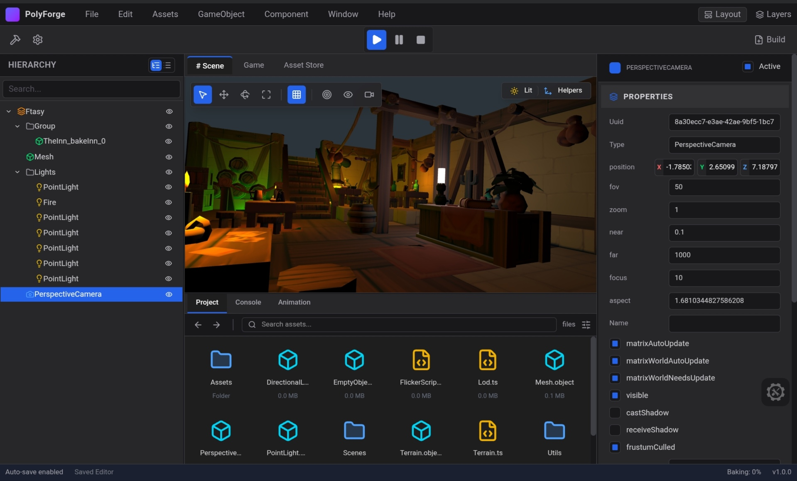

# PolyForge 3D Editor

PolyForge is a sleek, modern, web-based 3D editor UI inspired by industry standards like Unity and Unreal Engine. It is built with React, Tailwind CSS, and Lucide Icons to provide a responsive and high-performance interface for 3D content creation workflows.




### installation
```
yarn add
yarn dev
```


## 🌟 Key Features

### 🏗️ Hierarchy Panel
*   **Scene Graph**: robust tree view of all objects in the scene.
*   **Organization**: Support for nesting, parenting, and grouping objects.
*   **Context Menu**: Right-click to create new primitives (Cube, Sphere, Lights, Cameras) or manipulate existing objects (Copy, Duplicate, Delete).
*   **Search**: Filter scene objects by name.

### 🎨 Inspector Panel
*   **Dynamic Properties**: Context-aware inputs based on the selected object type.
*   **Component System**: Add and remove components like RigidBodies, Colliders, Lights, and Scripts.
*   **Asset Selection**: Integrated asset picker for assigning Materials, Textures, and Scripts to object properties.
*   **Transform Tools**: Precision editing for Position, Rotation, and Scale.

### 🎬 Timeline & Animation
*   **Multi-Clip Support**: Create and manage multiple animation clips per object (e.g., Idle, Run, Jump).
*   **Keyframing**: Add keyframes for any numeric property (Position, Rotation, Opacity).
*   **Scrubbing**: Real-time playhead scrubbing and playback controls.
*   **Track Management**: Add/remove property tracks dynamically.

### 🧊 Viewport
*   **Gizmos**: Visual manipulators for Move, Rotate, and Scale operations.
*   **Toolbar**: Quick access to transformation tools and snapping options.
*   **Context Aware**: Dynamic tools appear based on selection (e.g., Camera Preview, Light Settings).

### Scripting
   **scripting**: typescript/JavaScript scripting support using Behavior


### 📂 Asset Browser
*   **File Management**: Navigate folders and assets (Models, Scripts, Materials).
*   **Visual Grid**: Thumbnail view with type-specific icons.
*   **Context Actions**: Create new assets, folders, or scripts directly from the browser.

### ⚙️ Settings & Configuration
*   **Project Settings**: Configure Rendering, Physics, and Input preferences.
*   **Console**: Integrated debug console for logging messages, warnings, and errors.

## 🛠️ Tech Stack
*   **Framework**: React 19
*   **Styling**: Tailwind CSS
*   **Icons**: Lucide React
*   **Language**: TypeScript
*   **3dEngine**: Three.js


## 🚀 Getting Started

This project is a UI shell designed to be integrated with a 3D rendering engine Three.js. 